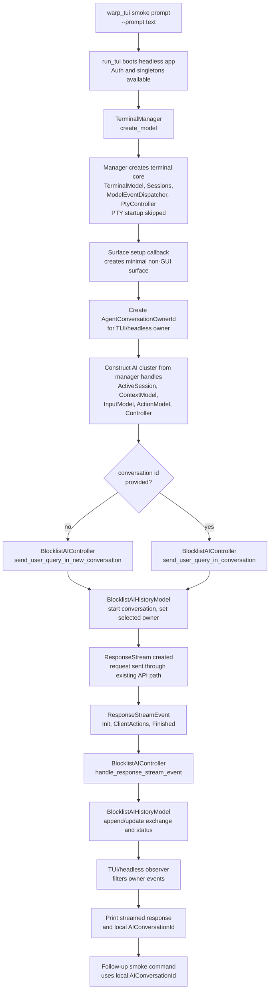

# TUI conversation streaming — TECH
## Context
This change productionizes the conversation-streaming part of the TUI prototype: a TUI/headless owner should be able to submit a prompt through the existing Agent Mode controller path, observe streamed response updates through the existing conversation history model, and submit a follow-up prompt against the same local conversation. It does not build the TUI transcript renderer.
The current GUI path wires Agent Mode inside [`TerminalView::new`](https://github.com/warpdotdev/warp/blob/34cfe62aca8cebc9aca735dbb726e097e4d2a6a7/app/src/terminal/view.rs#L3127-L3818) @ `34cfe62a`: the view creates `ActiveSession`, `AgentViewController`, `BlocklistAIContextModel`, `BlocklistAIInputModel`, `BlocklistAIActionModel`, `BlocklistAIController`, and the input view, then subscribes to `BlocklistAIHistoryModel` and executor models. The first TUI streaming implementation should mirror that ownership model instead of introducing a new `AgentConversationSession` abstraction.
`BlocklistAIHistoryModel` already owns most conversation identity and stream state. It stores live and cleared conversations by terminal view, the active conversation pointer, all in-memory conversations, and server-token reverse indexes in [`app/src/ai/blocklist/history_model.rs (195-276)`](https://github.com/warpdotdev/warp/blob/34cfe62aca8cebc9aca735dbb726e097e4d2a6a7/app/src/ai/blocklist/history_model.rs#L195-L276). It also owns the current active-conversation APIs and stream-start APIs in [`app/src/ai/blocklist/history_model.rs (1033-1169)`](https://github.com/warpdotdev/warp/blob/34cfe62aca8cebc9aca735dbb726e097e4d2a6a7/app/src/ai/blocklist/history_model.rs#L1033-L1169), and the owner-scoped history event filtering API in [`app/src/ai/blocklist/history_model.rs (2924-3007)`](https://github.com/warpdotdev/warp/blob/34cfe62aca8cebc9aca735dbb726e097e4d2a6a7/app/src/ai/blocklist/history_model.rs#L2924-L3007). The implementation should generalize those owner-shaped pieces from `terminal_view_id: EntityId` to `AgentConversationOwnerId`.
`BlocklistAIContextModel` currently stores `PendingQueryState` and reads selected conversation through `AgentViewController` when Agent View is enabled in [`app/src/ai/blocklist/context_model.rs (809-877)`](https://github.com/warpdotdev/warp/blob/34cfe62aca8cebc9aca735dbb726e097e4d2a6a7/app/src/ai/blocklist/context_model.rs#L809-L877). That makes the GUI controller the effective selected-conversation source of truth. The new design moves selected conversation into `BlocklistAIHistoryModel` so GUI and TUI can share the same next-prompt target state.
`BlocklistAIController` is already the correct request/streaming path. New conversations are created in [`start_new_conversation_for_request`](https://github.com/warpdotdev/warp/blob/34cfe62aca8cebc9aca735dbb726e097e4d2a6a7/app/src/ai/blocklist/controller.rs#L2278-L2301), requests are sent through [`send_request_input`](https://github.com/warpdotdev/warp/blob/34cfe62aca8cebc9aca735dbb726e097e4d2a6a7/app/src/ai/blocklist/controller.rs#L2312-L2560), and stream events are consumed by [`handle_response_stream_event`](https://github.com/warpdotdev/warp/blob/34cfe62aca8cebc9aca735dbb726e097e4d2a6a7/app/src/ai/blocklist/controller.rs#L2640-L2794). Tests can reuse the existing `ResponseStream::new_for_test` plus [`BlocklistAIController::register_mock_stream_for_test`](https://github.com/warpdotdev/warp/blob/34cfe62aca8cebc9aca735dbb726e097e4d2a6a7/app/src/ai/blocklist/controller.rs#L2619-L2634) seam.
`AgentViewController` currently stores a conversation ID in `AgentViewState::Active` and exposes helpers such as `active_conversation_id` in [`app/src/ai/blocklist/agent_view/controller.rs (244-339)`](https://github.com/warpdotdev/warp/blob/34cfe62aca8cebc9aca735dbb726e097e4d2a6a7/app/src/ai/blocklist/agent_view/controller.rs#L244-L339). It also creates or enters conversations in [`enter_agent_view_internal`](https://github.com/warpdotdev/warp/blob/34cfe62aca8cebc9aca735dbb726e097e4d2a6a7/app/src/ai/blocklist/agent_view/controller.rs#L716-L828). The controller should keep Agent View UI/lifecycle state, but derive its displayed conversation from history selected conversation instead of storing a separate conversation identity.
The current TUI entry point is intentionally small. [`crates/warp_tui/src/main.rs`](https://github.com/warpdotdev/warp/blob/34cfe62aca8cebc9aca735dbb726e097e4d2a6a7/crates/warp_tui/src/main.rs#L1-L40) starts the headless app through `warp::run_tui`, and [`app/src/tui.rs`](https://github.com/warpdotdev/warp/blob/34cfe62aca8cebc9aca735dbb726e097e4d2a6a7/app/src/tui.rs#L1-L97) currently proves auth reuse by logging in and printing the user ID. This spec extends that path with a prompt smoke mode; it does not require the full prototype transcript UI.
## Proposed changes
### Conversation owner identity
Add `AgentConversationOwnerId` as a newtype over `EntityId`, with `Copy`, `Clone`, `Debug`, `PartialEq`, `Eq`, and `Hash`. GUI code converts `TerminalView::id()` into `AgentConversationOwnerId` when crossing into conversation/history APIs; TUI/headless code converts its root app entity into the same type.
Within `BlocklistAIHistoryModel`, rename owner-shaped fields and methods from terminal-view terminology to owner terminology in the same change:
- `live_conversation_ids_for_terminal_view` becomes `live_conversation_ids_for_owner`.
- `cleared_conversation_ids_for_terminal_view` becomes `cleared_conversation_ids_for_owner`.
- `active_conversation_for_terminal_view` becomes `active_conversation_for_owner`.
- owner-scoped methods and events use `owner_id: AgentConversationOwnerId`.
GUI boundary code may keep local variables named `terminal_view_id` where the value is truly the GUI view ID, but the history model should not expose new `terminal_view_id` APIs.
### Selected conversation in history
Add `selected_conversation_for_owner: HashMap<AgentConversationOwnerId, AIConversationId>` to `BlocklistAIHistoryModel`.
Add accessors:
- `selected_conversation_id(owner_id) -> Option<AIConversationId>`
- `selected_conversation(owner_id) -> Option<&AIConversation>`
- `set_selected_conversation_id(owner_id, conversation_id, ctx)`
- `clear_selected_conversation(owner_id, ctx)`
`set_selected_conversation_id` should no-op with a warning if the conversation is not live for that owner. Clearing, removing, deleting, transferring ownership, and clearing all conversations for an owner must maintain the invariant that selected conversation never points at a non-live conversation.
Starting a conversation does not select it by itself because passive/background conversations also use `start_new_conversation`. Agent View entry and user-query submission explicitly select their target conversation; passive/background requests must not steal the next user prompt target.
Add a history event:
- `SelectedConversationChanged { owner_id, previous_conversation_id, selected_conversation_id }`
No event should be emitted when the selected value does not change.
Keep active conversation naming for this phase, but clarify comments. Active conversation is the owner’s current or most recent progress/stream target. Selected conversation is the owner’s next user prompt target and the displayed conversation when Agent View is active.
### Agent View controller state
Do not introduce a third “open conversation” identity. `AgentViewController` should own only UI/lifecycle state:
- active vs inactive
- inline vs fullscreen display mode
- entry origin
- original exchange count when the view was entered
- confirmation state
When Agent View is active, `AgentViewController` should derive the current conversation from `BlocklistAIHistoryModel::selected_conversation_id(owner_id)`. Entering or switching Agent View should set selected conversation in history. Exiting Agent View should clear selected conversation only when the exit semantics mean “no conversation is selected for the next prompt”; in-place switches should not briefly clear and re-set selection.
`TerminalModel`/`BlockList` still needs the selected conversation while holding the terminal lock so it can compute block and rich-content visibility without reaching into global application state. Keep a derived `AgentViewState` render snapshot on the terminal model for that purpose. The snapshot is written by `AgentViewController` from the history-selected conversation when entering Agent View and cleared on exit; it is not a third semantic conversation identity or a source of truth.
`BlocklistAIContextModel::selected_conversation_id(ctx)` should read the history selected conversation for its owner, not `AgentViewController::agent_view_state()`. Existing legacy non-Agent-View branches only need to keep compiling; they should not drive the design.
### TUI/headless prompt smoke path
Extend the existing `warp_tui` path with a smoke mode that can be run from cargo. The smoke path should reuse the productionized local terminal manager construction path. It should call `local_tty::TerminalManager::<TuiConversationSurface>::create_model(...)` with a small TUI/headless surface instead of constructing `TerminalModel`, `Sessions`, `ModelEventDispatcher`, PTY channels, or controllers directly.
`TuiConversationSurface` should be a minimal non-GUI `TerminalSurface` implementation for this phase. It should exist to give `TerminalManager<S>` a concrete surface owner, receive lifecycle callbacks, and expose the manager-created terminal/session/AI model handles needed by the smoke path. It should not reuse `TerminalView`, because `TerminalView` brings GUI rendering, pane, input editor, rich-content, session-sharing UI, and Agent View UI responsibilities that this phase is explicitly avoiding.
The generic manager call should own the same construction order as the GUI path:
1. `TerminalManager::<TuiConversationSurface>::create_model(...)` creates the terminal channels, `Sessions`, `ModelEventDispatcher`, `TerminalModel`, `PtyController`, and PTY lifecycle state.
2. Its surface setup callback receives `TerminalSurfaceInit`, including the manager-created `TerminalModel`, `Sessions`, `ModelEventDispatcher`, wakeup receiver, inactive PTY reads receiver, colors, and initial size.
3. The callback creates the minimal `TuiConversationSurface` and constructs the TUI/headless AI model/controller cluster from those manager-created handles.
4. The manager wires the surface to the `PtyController`. `TuiConversationSurface::should_start_pty()` returns `false`, so the manager retains the manager-created terminal/session/controller core but intentionally skips shell/PTY startup for this conversation-only smoke path.
This keeps terminal-session ownership in `TerminalManager<S>` and keeps the TUI conversation work focused on prompt submission and stream observation. A later TUI transcript-rendering branch can either extend this surface or add a real TUI view that observes the same manager-owned model; this phase should not duplicate terminal model/session construction.
The exact CLI can be adjusted during implementation, but the intended shape is:
- `cargo run -p warp_tui -- --prompt "say hi"`
- `cargo run -p warp_tui -- --conversation-id <local-ai-conversation-id> --prompt "follow up"`
The smoke mode should:
1. boot the real headless Warp app through `warp::run_tui`
2. construct a manager-owned local terminal session through `TerminalManager::<TuiConversationSurface>::create_model(...)`
3. construct the same AI model/controller cluster shape as GUI from the `TerminalSurfaceInit` handles, without requiring `AgentViewController`
4. submit a new prompt through `BlocklistAIController::send_user_query_in_new_conversation`
5. observe `BlocklistAIHistoryModel` events for this `AgentConversationOwnerId`
6. print streamed text/status and the local client `AIConversationId`
7. accept that local ID for `send_user_query_in_conversation` in a follow-up smoke run
This is a testing harness, not a durable external resume API. It should not support server conversation tokens in this phase.
Tool calls, shell command execution, action approval, and autoexecute are out of scope. If the response requests unsupported client action handling, the smoke path should fail or report unsupported clearly rather than waiting for a TUI UI that does not exist.
### Streaming event observation
The TUI/headless observer should subscribe to `BlocklistAIHistoryModel` and filter by `AgentConversationOwnerId`. It should not talk directly to the server stream. It should derive output from the same conversation/exchange state the GUI renders today.
The first implementation can emit simple lines or JSONL from the smoke path. If JSONL is chosen during implementation, keep events minimal: conversation started, text updated, status changed, finished, and error. This output format is for validation only and should not become a product API without a separate decision.
## End-to-end flow

## Testing and validation
Add direct `BlocklistAIHistoryModel` unit tests for owner and selection invariants:
- owner maps store and return conversations by `AgentConversationOwnerId`
- selected conversation can be set, read, and cleared
- selecting a non-live conversation no-ops and emits no change event
- clearing/removing conversations clears selected conversation
- selected and active conversation can differ for one owner
Add controller-level tests using `ResponseStream::new_for_test` and `BlocklistAIController::register_mock_stream_for_test`:
- mock stream events flow through `BlocklistAIController` into `BlocklistAIHistoryModel`
- the observer sees appended exchange, streaming update, and finished status through history events
- a follow-up prompt targets the selected/local conversation ID rather than creating a new conversation
Add a manual smoke validation:
- run `cargo run -p warp_tui -- --prompt "say hi"` and confirm streamed output plus local `AIConversationId`
- run `cargo run -p warp_tui -- --conversation-id <id> --prompt "what did I ask you to do?"` and confirm the response continues the same local conversation
- use prompts that do not require tools or shell execution in this phase
Validation performed while implementing the first vertical slice:
- `cargo run -p warp_tui -- --prompt "Reply with exactly: hello from tui"` emitted a local `AIConversationId`, streamed `hello` then `hello from tui`, and finished successfully
- running the built `warp-tui` binary with that conversation ID and asking for the first response returned `hello from tui`, proving cross-process local-ID restoration and follow-up continuity
Run formatting and compile checks:
- `./script/format`
- `cargo check -p warp`
- `cargo check -p warp_tui`
- focused `cargo nextest run -p warp` filters for history model, controller stream, and any TUI smoke helper tests
## Parallelization
Do not parallelize the core implementation across agents. The main edits touch the same ownership layer (`BlocklistAIHistoryModel`), `AgentViewController`, `BlocklistAIContextModel`, and `BlocklistAIController` constructor/call sites, so parallel coding would create overlapping diffs and hard-to-review conflicts.
Validation can be parallelized after the code compiles. One agent can run focused history/controller tests while another runs the cargo smoke command in the worktree, but code integration should remain single-threaded.
## Risks and mitigations
- **Conversation identity churn breaks GUI behavior.** Keep GUI boundary conversion explicit: `TerminalView::id()` becomes `AgentConversationOwnerId` only when entering history/controller APIs.
- **Selected and active conversation semantics blur.** Add comments on both fields and APIs. Active is current/recent progress target; selected is next prompt target and Agent View display target.
- **AgentViewController refactor is too broad.** Limit the controller change to removing canonical conversation ownership. Preserve display mode, origin, exchange-count, and confirmation responsibilities.
- **TUI smoke path hangs on actions.** Treat tool/action execution as unsupported in this phase and report clearly instead of waiting for an approval UI.
- **Manual smoke command depends on auth/server state.** Keep no-network automated tests at the history/controller layers and use the cargo smoke command only as manual validation for real streaming.
## Follow-ups
- Add TUI transcript/rich-content rendering using the history stream once the prompt/streaming APIs are proven.
- Add TUI/headless action/tool handling as a separate branch with an explicit policy for unsupported, approved, or autoexecuted actions.
- Decide whether the smoke output should become a stable JSONL/debug interface or remain an internal validation path.
- Consider cleanup of legacy non-Agent-View pending-query state once Agent View-only behavior is fully enforced.
