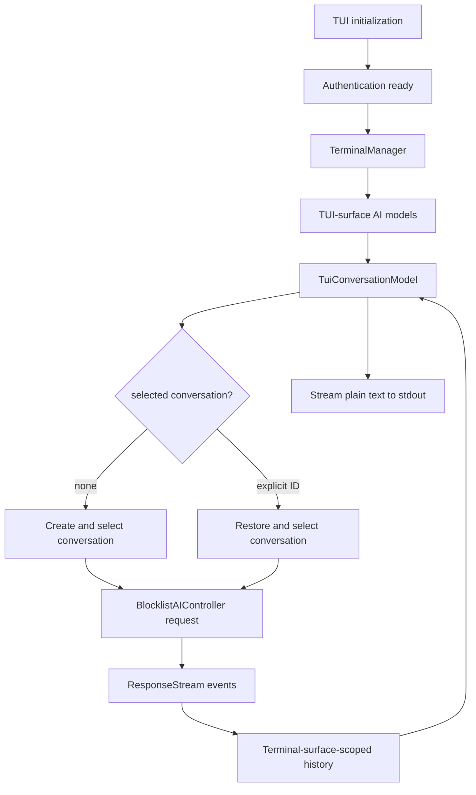

# TUI conversation streaming — TECH
## Context
This change adds a one-shot TUI path that sends a prompt through Warp's production AI controller and streams plain-text output to stdout. The reusable coordination model is designed to support a future interactive TUI without introducing an alternate request or response-stream implementation.
`BlocklistAIHistoryModel` stores conversations and active/progress state per terminal surface. Active conversation means the current or most recent stream/progress target; it remains distinct from the conversation selected for the next prompt (`app/src/ai/blocklist/history_model.rs:206`, `app/src/ai/blocklist/context_model.rs:895`).
GUI terminal views select conversations through `AgentViewController`. TUI surfaces select conversations through `BlocklistAIContextModel::PendingQueryState`; they do not construct Agent View UI state (`app/src/ai/blocklist/context_model.rs:73`).
## Design
### Explicit surface constructors
`BlocklistAIContextModel`, `BlocklistAIInputModel`, and `BlocklistAIController` expose explicit constructors for their two supported surfaces:
- `new_for_terminal_view(...)` requires an `AgentViewController` and preserves GUI Agent View lifecycle behavior.
- `new_for_tui_surface(...)` does not accept an `AgentViewController`; selection stays in pending query state and Agent View lifecycle subscriptions are omitted.
The public constructor name makes the surface choice explicit. A private `new_for_surface(...)` implementation contains shared subscription and initialization logic (`app/src/ai/blocklist/context_model.rs:176`, `app/src/ai/blocklist/input_model.rs:225`, `app/src/ai/blocklist/controller.rs:430`).
### Terminal-surface-scoped history
WarpUI `EntityId` is the routing key for a terminal surface. History fields, methods, and events use `terminal_surface_id` terminology consistently:
- live, cleared, and active conversation IDs are keyed by terminal surface
- clear, restore, selection-transfer, and streaming events carry terminal surface IDs
- GUI-local APIs retain terminal-view terminology when they specifically address `TerminalView`
Moving a conversation between surfaces emits `ConversationTransferredBetweenTerminalSurfaces`, allowing the previous surface to discard rendered blocks while the destination becomes canonical (`app/src/ai/blocklist/history_model.rs:1047`, `app/src/ai/blocklist/history_model.rs:2855`).
### TUI conversation coordination
`TuiConversationModel` is the reusable per-surface coordination boundary (`app/src/tui/conversation_model.rs:31`). It contains no transcript widgets and coordinates:
- the surface's selected conversation
- creation and selection of a new conversation
- restore and selection of an existing conversation
- prompt submission through `BlocklistAIController`
- terminal-surface-filtered history events for conversation start, stream updates, status changes, selection changes, and errors
`send_prompt(...)` targets the current selection or creates a conversation when none is selected. `restore_conversation_and_send_prompt(...)` restores and selects a supplied conversation ID before delegating to `send_prompt(...)` (`app/src/tui/conversation_model.rs:116`).
### One-shot prompt streaming
`PromptStreamSurface` adapts `TuiConversationModel` events to stdout and application termination (`app/src/tui/prompt_stream.rs:57`). It is named for its actual behavior rather than as a test fixture.
TUI initialization always completes authentication before dispatching either prompt streaming or the default user-ID command (`app/src/tui.rs:23`). Prompt streaming uses the normal local terminal-manager and PTY lifecycle; there is no surface-specific PTY startup switch.
`PtySpawner` can safely use the standard terminal-server subprocess from a `warp-tui` executable. The TUI argument bridge recognizes Warp worker invocations and leaves their arguments untouched; `warp::run_tui()` dispatches them through the same worker runner used by `warp::run()` before starting the TUI frontend (`crates/warp_tui/src/bin/args.rs:11`, `app/src/lib.rs:631`). This lets TUI launches register the same early `PtySpawner` singleton as other Warp launches without recursively starting more TUI frontends, and preserves dispatch for other current-executable workers.
The adapter prints the local conversation ID, changed plain-text snapshots, and final status. Tool actions fail clearly because this phase does not provide approval or action UI.
### Channel-specific binaries
The `warp_tui` package mirrors GUI channel binaries. Every channel-specific binary uses the shared `src/bin/args.rs` module through a normal sibling `mod args;` declaration. Arguments are forwarded to headless app initialization:
- `--prompt <text>`
- `--conversation-id <local-ai-conversation-id>`
Bare `cargo run -p warp_tui` uses the OSS/production channel; `./script/run-tui -- --prompt ...` selects the internal local channel when its channel config is available.
## End-to-end flow

## Testing and validation
Automated coverage verifies:
- terminal-surface-scoped history maps and active/progress state
- TUI context selection remains independent from GUI Agent View state
- creating a TUI conversation selects it for the correct terminal surface
- selecting a new conversation, restoring an existing conversation, and sending a follow-up retain the same local conversation ID
- mock response-stream events flow through `BlocklistAIController` into filtered history/model events
- every channel-specific TUI binary forwards prompt-streaming CLI arguments
- Warp worker invocations bypass TUI prompt parsing and use the shared worker dispatcher
Manual validation:
- `cargo run -p warp_tui -- --prompt "Reply with exactly: hello from tui"` emits a local ID, streamed text, and `status=Success`
- a separate process using that ID with `--conversation-id` restores the conversation and recalls the previous response
- prompts requiring tools terminate with an unsupported-action error rather than hanging
Run:
- `./script/format`
- `cargo check -p warp -p warp_tui`
- `cargo check -p warp --tests`
- `cargo check -p warp --features integration_tests --tests`
- `cargo clippy -p warp -p warp_tui --all-targets -- -D warnings`
- focused nextest filters for history, context selection, TUI model, and controller response-stream tests
## Out of scope
- Transcript/rich-content TUI widgets
- TUI workspace/root orchestration UI
- TUI tool/action execution, approval UI, shell execution, or autoexecute policy
- A shared cross-surface `AgentConversationSession`
- A raw server-stream client that bypasses `BlocklistAIController`
- A stable external stdout protocol
## Risks and mitigations
- **GUI behavior regresses.** Explicit GUI constructors require `AgentViewController` and preserve existing Agent View subscriptions.
- **Active/progress and selected/next-prompt semantics blur.** Keep active state in history and selection in each surface's context/controller model.
- **A TUI selection becomes invalid.** Reconcile selection from removal, deletion, transfer, clear, and split events.
- **One-shot presentation policy leaks into reusable models.** Keep stdout, termination, and unsupported-action behavior in `PromptStreamSurface`.
