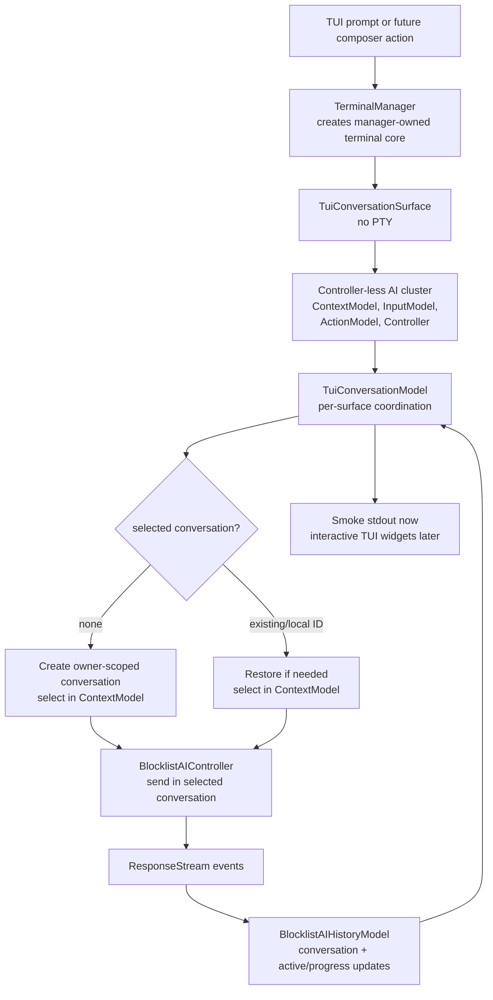

# TUI conversation streaming — TECH
## Context
This change creates production-shaped conversation building blocks for a future interactive TUI. A TUI surface should be able to select or start a conversation, send prompts, observe streamed responses, restore an existing conversation, and later participate in orchestration across multiple TUI surfaces. This phase does not build transcript-rendering widgets or tool/action UI.
The GUI path already has a coherent selection and lifecycle owner: `AgentViewController` stores the displayed conversation in its conversation-bearing `AgentViewState`, copies that state into `TerminalModel` for lock-safe rendering, and coordinates Agent View entry and exit. This change preserves that contract and does not introduce alternative GUI selection APIs.
`BlocklistAIContextModel` already represents pending composer state, including whether the next query starts a new conversation or continues an existing conversation through `PendingQueryState`. When it has an `AgentViewController`, its selected-conversation getter reads the GUI controller. When it has no controller, its own pending query state is the surface selection. The controller-less behavior is the selection model for TUI surfaces.
`BlocklistAIHistoryModel` owns conversation data, live/cleared ownership, active/progress state, persistence metadata, and parent/child orchestration topology. Active conversation means the current or most recent stream/progress target; it is intentionally distinct from a surface's selected next-prompt target. Selection is per-surface state and is not stored in history.
`BlocklistAIController` remains the production request and response-stream path. `TuiConversationModel` coordinates that controller, a controller-less context model, and owner-filtered history events behind a TUI-facing API.
## Proposed changes
### Conversation owner identity
Use WarpUI `EntityId` as the opaque routing key for a conversation owner. History and conversation models remain owner-agnostic: they use the ID to scope state and events, but do not distinguish or branch on owner kinds.
Generalize owner-shaped history fields, methods, and events from terminal-view terminology to owner terminology:
- live and cleared conversation IDs are keyed by owner
- active/progress conversation is keyed by owner
- owner-scoped history methods and events accept or emit `EntityId` values named `terminal_surface_id`
GUI-local APIs and variables keep terminal-view terminology where they still represent GUI `TerminalView` IDs. The owner-oriented history boundary does not introduce a separate owner type or expose GUI-specific naming.
### Per-surface selected conversation
Preserve one selected-conversation implementation per surface:
- GUI surfaces use `AgentViewController::agent_view_state()` exactly as before.
- Controller-less TUI surfaces use `BlocklistAIContextModel::PendingQueryState`.
`BlocklistAIContextModel::selected_conversation_id(ctx)` reads the Agent View controller when present and otherwise reads its pending query state. A controller-less new-conversation operation creates an owner-scoped conversation and immediately records it as `PendingQueryState::Existing`, allowing an empty conversation to remain selected before the first prompt.
Generic request, response-stream, queued-prompt, passive, and background paths update history active/progress state but do not change selection. Surface actions are the only selection authority.
Controller-less context models clear invalid selections when owner-scoped history events remove, delete, transfer, or clear the selected conversation. A split selects the new conversation only when the split source was selected.
### TUI conversation model
Add `TuiConversationModel` as the reusable per-surface coordination boundary for a future interactive TUI. It owns:
- the surface's owner `EntityId`
- its controller-less `BlocklistAIContextModel`
- its production `BlocklistAIController`
- subscriptions to owner-filtered `BlocklistAIHistoryModel` events
It exposes clear homes for:
- reading and changing the selected conversation
- creating and selecting a new conversation
- restoring/selecting an existing conversation
- sending a prompt to the selected conversation
- observing conversation start, stream updates, status changes, selection changes, and errors
`TuiConversationModel` owns no transcript widgets. A future TUI workspace/root model can own many TUI surfaces and coordinate focus and orchestration navigation across them. Global orchestration topology remains in history; selection remains local to each surface.
`TuiConversationSurface` remains the no-PTY `TerminalSurface` required by the productionized terminal-manager construction path. For the current cargo-runnable smoke flow, it adapts `TuiConversationModel` events to stdout and process termination. Replacing that adapter with interactive widgets must not require replacing the conversation model.
### Manager-owned terminal core
Construct each TUI surface through `local_tty::TerminalManager<TuiConversationSurface>::create_model(...)`.
1. The manager creates terminal channels, `Sessions`, `ModelEventDispatcher`, `TerminalModel`, `PtyController`, and lifecycle state.
2. The surface callback receives `TerminalSurfaceInit` and constructs the controller-less AI cluster.
3. The surface creates `TuiConversationModel` from the context/controller handles.
4. `TuiConversationSurface::should_start_pty()` returns `false`, preserving the manager-owned terminal/session core while skipping shell startup.
### Channel-specific TUI binaries and smoke CLI
The `warp_tui` package mirrors GUI channel binaries. Every channel-specific binary shares argument parsing for:
- `--prompt <text>`
- `--conversation-id <local-ai-conversation-id>`
Arguments are forwarded to headless app initialization. Bare `cargo run -p warp_tui` uses the OSS/production channel; `./script/run-tui -- --prompt ...` selects the internal local channel when its channel config is available.
The smoke adapter prints the local conversation ID, streamed plain-text snapshots, and final status. Unsupported tool/actions fail clearly instead of waiting for UI that does not exist.
## End-to-end flow

## Testing and validation
Automated coverage should verify:
- owner-scoped history maps and active/progress state
- controller-less context selection is independent from GUI Agent View state
- creating a controller-less conversation selects it and scopes it to the correct owner
- selecting a new conversation, restoring an existing conversation, and sending a follow-up retain the same local conversation ID
- mock response-stream events flow through `BlocklistAIController` into owner-filtered history/model events
- every channel-specific TUI binary forwards smoke CLI arguments
Manual validation:
- `cargo run -p warp_tui -- --prompt "Reply with exactly: hello from tui"` emits a local ID, streamed text, and `status=Success`
- a separate process using that ID with `--conversation-id` restores the conversation and recalls the previous response
- prompts requiring tools terminate with an unsupported-action error rather than hanging
Run:
- `./script/format`
- `cargo check -p warp -p warp_tui`
- `cargo check -p warp --tests`
- `cargo check -p warp --features integration_tests --tests`
- `cargo clippy -p warp -p warp_tui --all-targets -- -D warnings`
- focused nextest filters for owner/history, context selection, TUI model, and controller response-stream tests
## Out of scope
- Transcript/rich-content TUI widgets
- TUI workspace/root orchestration UI
- TUI tool/action execution, approval UI, shell execution, or autoexecute policy
- A shared cross-surface `AgentConversationSession`
- A raw server-stream client that bypasses `BlocklistAIController`
- Making the smoke stdout format a stable external API
## Risks and mitigations
- **GUI behavior regresses from unnecessary abstraction changes.** Preserve existing `AgentViewController`, `AgentViewState`, and GUI-local terminal-view accessors; generalize only history ownership boundaries.
- **Owner identity leaks surface-specific behavior into shared models.** Treat owner `EntityId`s as opaque routing keys; keep surface-specific navigation and lifecycle behavior outside history and conversation models.
- **Active/progress and selected/next-prompt semantics blur.** Keep active state history-owned and selection surface-owned; never select from generic request or stream code.
- **A controller-less selected conversation becomes invalid.** Reconcile selection from owner-scoped removal, deletion, transfer, clear, and split events.
- **A future multi-session TUI conflates focus and selection.** Give each TUI surface its own owner and context selection; let a later root model own focus and topology navigation.
- **Smoke-only behavior leaks into production models.** Keep stdout, termination, and unsupported-action presentation policy on `TuiConversationSurface`; keep reusable conversation operations and events on `TuiConversationModel`.