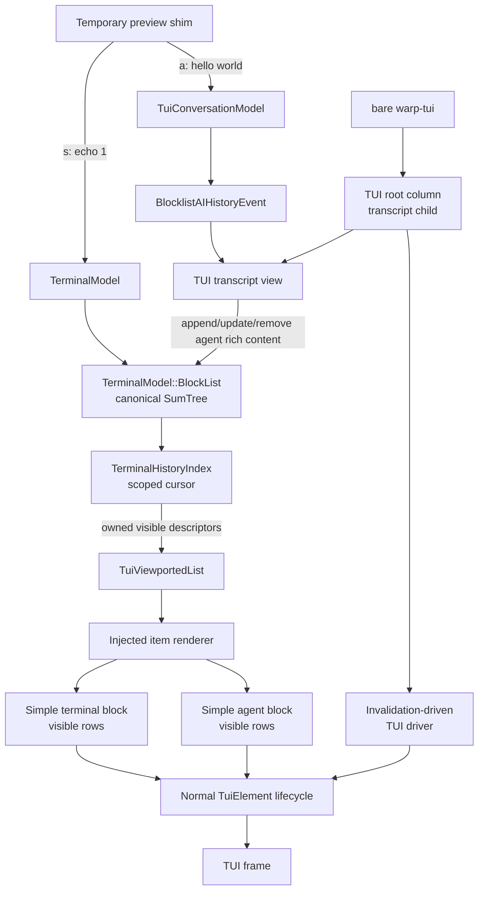

# TUI transcript view — TECH
## Context
This PR builds the first production-shaped conversation transcript view for Warp's TUI. It proves the transcript container and canonical ordering path with two intentionally simple block renderers:
- an agent block that renders user input and streamed plain-text agent output
- a terminal block that renders command/input and streamed terminal output
Bare `warp-tui` launches a real TUI root column containing the transcript view. The existing `--prompt` one-shot stdout path remains unchanged. A clearly isolated preview shim maps `s` to a harmless shell command and `a` to a fixed agent prompt so terminal and agent blocks can be interleaved manually until the real input view lands.

Rich block content, interactive block affordances, and the full TUI input experience are outside this PR. Those features must extend the block-render boundary established here rather than alter the transcript container or introduce a TUI-specific blocklist.

The existing TUI conversation-streaming stack already routes prompts through the production AI controller and exposes terminal-surface-filtered presentation events. `crates/warp_tui/src/conversation_model.rs` deliberately contains no transcript widgets; `crates/warp_tui/src/prompt_stream.rs` is a one-shot stdout adapter, not the interactive transcript presentation layer. The foundational selection, request, and terminal-surface ownership decisions remain as documented in [`specs/conversation-streaming-for-tui/TECH.md`](../conversation-streaming-for-tui/TECH.md).

WarpUI already has a TUI-specific element/view/presenter stack. [`TuiElement`](https://github.com/warpdotdev/warp/blob/e36e8ddf823d6a25a5225251a7db60698f5da74d/crates/warpui_core/src/elements/tui/mod.rs#L96-L140) defines the normal layout, rendering, presentation, event, and cursor lifecycle, while [`TuiPresenter`](https://github.com/warpdotdev/warp/blob/e36e8ddf823d6a25a5225251a7db60698f5da74d/crates/warpui_core/src/presenter/tui.rs#L81-L208) retains laid-out trees and records child-view embeddings. The transcript must return normal visible `TuiElement` trees so this lifecycle remains intact; it must not use a context-free raw-buffer row renderer.

`TerminalModel::BlockList` is the canonical ordered presentation model for a terminal surface. Its heterogeneous [`BlockHeightItem`](https://github.com/warpdotdev/warp/blob/e36e8ddf823d6a25a5225251a7db60698f5da74d/app/src/terminal/model/blocks.rs#L121-L196) sum tree orders terminal blocks and rich content and tracks accumulated height, count, and block count in [`BlockList`](https://github.com/warpdotdev/warp/blob/e36e8ddf823d6a25a5225251a7db60698f5da74d/app/src/terminal/model/blocks.rs#L225-L270). Terminal output updates model-authoritative block heights, while view-measured rich content uses dirty marking and height writeback ([`mark_rich_content_dirty`](https://github.com/warpdotdev/warp/blob/e36e8ddf823d6a25a5225251a7db60698f5da74d/app/src/terminal/model/blocks.rs#L1173-L1180), [`update_rich_content_heights`](https://github.com/warpdotdev/warp/blob/e36e8ddf823d6a25a5225251a7db60698f5da74d/app/src/terminal/model/blocks.rs#L2349-L2351)). The GUI follows the same canonical-order model by inserting one rich-content AI block per exchange in [`TerminalView::handle_ai_history_model_event`](https://github.com/warpdotdev/warp/blob/e36e8ddf823d6a25a5225251a7db60698f5da74d/app/src/terminal/view.rs#L6030-L6220).

The TUI transcript will use this existing order. It will not own a second transcript order or introduce a `TUIBlocklistElement`.
## Proposed changes
### TUI transcript composition root
Change the no-prompt TUI frontend callback in `crates/warp_tui/src/lib.rs`: after app-side authentication, bare `warp-tui` starts a real TUI session instead of printing the authenticated user ID and exiting. `warp-tui --prompt ...` continues using the existing one-shot `PromptStreamSurface` stdout behavior.

Add a root TUI view whose rendered tree is initially only:
```rust
TuiColumn::new().with_child(Box::new(TuiChildView::new(&transcript_view)))
```

The root is also the `TerminalSurface` driven by the normal local terminal manager so its transcript reads the same `TerminalModel` that receives shell output. Keep the manager, root view, and TUI runtime/driver alive in a TUI-session singleton.

The current WarpUI TUI runtime has a blocking `TuiRuntime`, but the `warp_tui` frontend callback runs inside the shared app event loop. Add an invalidation-driven headless driver entry point under `crates/warpui_core/src/runtime/` that:
- enters and restores raw mode plus the alternate screen through an owned guard
- draws the root view when its window is invalidated
- reads crossterm input off the foreground thread and dispatches converted events through the shared core
- retains a `TuiDriverHandle` whose lifetime controls the driver and terminal guard

This is runtime plumbing for the real TUI composition root, not transcript-specific behavior.

### Isolated preview shim
Add one clearly named, self-contained preview module under `crates/warp_tui/src/`, attached at one call site in the transcript root. Until the real input view lands, it handles exactly two keys:
- `s` emits the existing terminal command-execution intent for `echo 1`
- `a` submits the fixed prompt `hello world` through `TuiConversationModel`

The shim must:
- use the normal terminal manager/surface command path for `s` so the resulting terminal block and streamed output exercise the real transcript
- use the production TUI conversation/controller path for `a` so the resulting agent block and streamed output exercise the real transcript
- allow repeated and alternating `s`/`a` presses to prove canonical terminal/agent interleaving
- contain no reusable input-editor or routing logic
- be removable by deleting the module and its single root attachment
- be identified in code as temporary preview scaffolding
### Generalized TUI viewport element
Add a generalized viewported-list element under `crates/warpui_core/src/elements/tui/`. The element is TUI-specific but storage- and content-agnostic: it knows ordered item identities, logical row heights, scroll state, and visible element trees, but it does not know `TerminalModel`, `BlockList`, terminal blocks, or agent exchanges.

The viewport holds:
- a caller-provided ordered-index adapter
- an injected item-render function
- persistent scroll state
- the normal `TuiElement` trees retained for the current visible outer-item slices

The ordered-index adapter exposes stable identity, height, efficient seek, and scoped forward/backward traversal over a caller-owned ordered-height structure. The viewport owns the generic anchor/height walking algorithm. A scoped cursor may borrow or lock the backing store only while the viewport collects owned descriptors; the cursor scope ends before item rendering begins.

Illustrative API shape:
```rust
trait TuiViewportIndex {
    type ItemId: Clone + Eq;
    type Item;

    fn with_cursor<R>(
        &self,
        position: TuiViewportIndexPosition<'_, Self::ItemId>,
        f: impl FnOnce(&mut dyn TuiViewportCursor<ItemId = Self::ItemId, Item = Self::Item>) -> R,
    ) -> R;

    fn update_heights(&self, updates: &[(Self::ItemId, usize)]);
}

struct ViewportRenderRequest<Item> {
    item: Item,
    visible_rows: Range<usize>,
    width: u16,
}

struct RenderedViewportItem {
    element: Box<dyn TuiElement>,
    measured_full_height: Option<usize>,
}
```

The item-render function receives an owned opaque descriptor, its visible logical row range, the actual width, and read-only application access. It returns a normal visible element tree and optionally reports the item's full measured logical height. It never receives the final `TuiBuffer` and never paints raw rows outside the normal element lifecycle.

Logical item heights, accumulated offsets, and intra-item anchors use `usize` rows. Conversion to ratatui's `u16` geometry occurs only for the bounded visible destination rectangle.

### Layout-time application access
Extend `TuiLayoutContext` with read-only `AppContext`, matching the GUI element-layout contract. The viewport only knows the actual width and visible intra-item row ranges during layout; read-only application access lets the injected renderer construct the corresponding visible element trees without precomputing off-screen content.

Layout-time application mutation remains prohibited. Arbitrary element/view code must not run while a terminal-model lock is held.

### Viewport state and height reconciliation
Viewport scroll state is either:
- `FollowBottom`
- `Anchored { item_id, row_offset }`

The initial state is `FollowBottom`. User scrolling away from the end produces a stable item/row anchor; an explicit End/follow-bottom action restores `FollowBottom`. Anchored item shrink clamps the row offset. If an anchored item no longer exists, the viewport safely returns to `FollowBottom`. Clear/reset also restores `FollowBottom`.

Each ordered-index descriptor carries a cached or estimated height and whether a view-measured height is dirty. The viewport measures only visible dirty items. Model-authoritative terminal blocks do not report height feedback; view-measured agent blocks report their full logical height separately from their visible slice element.

The viewport batches changed heights and applies them through the index adapter with one short writeback phase. It then preserves or recomputes its anchor and repeats visible-range collection and layout within the current pass until stable. Stabilization is subject to a strict pass limit; non-convergence emits diagnostics and schedules another frame.

Only currently visible outer-item element trees participate in presentation, rendering, event dispatch, and cursor resolution. Fully off-screen child views are not presented or dispatched to.

### Terminal history index
Add a `TerminalHistoryIndex` adapter under `crates/warp_tui/src/` over the canonical `TerminalModel::BlockList` sum tree.

The adapter maps canonical entries to owned TUI transcript descriptors:
```rust
enum TerminalHistoryItemId {
    TerminalBlock(BlockId),
    AgentBlock(EntityId),
}

enum TerminalHistoryItem {
    TerminalBlock { block_id: BlockId },
    AgentBlock {
        view_id: EntityId,
        conversation_id: AIConversationId,
        exchange_id: AIAgentExchangeId,
    },
}
```

The adapter uses one scoped sum-tree traversal to seek and walk ordered entries. It does not repeatedly scan from the start of the blocklist. It skips unsupported blocklist item kinds in this PR rather than rendering placeholders for them.

`TerminalHistoryIndex` collects owned descriptors while holding the terminal-model lock, releases that lock, and only then permits the viewport to invoke the item-render function. Generic view-measured height updates are batched and written back into rich-content heights under one short lock.

Small public `BlockList` helpers may be added where required to seek rich-content positions and read/update dirty rich-content height state. The `warp_tui` crate accesses those helpers and other app-owned model types only through the narrow `warp::tui_export` boundary.

### Transcript view and exchange lifecycle
Add a TUI transcript view under `crates/warp_tui/src/` that owns the generalized viewport state and the terminal-history integration. The root TUI view embeds it as its only column child in this PR. It subscribes to terminal-surface-scoped `BlocklistAIHistoryEvent`s and mirrors the existing GUI model-level lifecycle:
- `AppendedExchange` creates a simple TUI agent block view and inserts one `RichContentItem` into the canonical `BlockList`.
- `UpdatedStreamingExchange` invalidates the corresponding agent block's content/height and notifies the transcript.
- `ReassignedExchange` updates the block's conversation association.
- removal, deletion, clear, and transfer events remove the affected TUI agent rich-content entries.
TUI agent rich-content entries intentionally leave `agent_view_conversation_id` unset. That field encodes GUI Agent View filtering; setting it while the TUI block list remains in `AgentViewState::Inactive` causes the shared `BlockList` height-update path to hide the entry. The TUI transcript keeps its conversation/exchange association in its own registration map while retaining canonical outer ordering in `BlockList`.

The transcript renders `TerminalHistoryIndex` through an injected item-render function:
```rust
TuiViewportedList::new(index, move |request, app| {
    match request.item {
        TerminalHistoryItem::TerminalBlock { block_id } => {
            render_terminal_block(block_id, request.visible_rows, request.width, app)
        }
        TerminalHistoryItem::AgentBlock { conversation_id, exchange_id, .. } => {
            render_agent_block(
                conversation_id,
                exchange_id,
                request.visible_rows,
                request.width,
                app,
            )
        }
    }
})
```

### Simple terminal block
Add a simple terminal-block renderer under `crates/warp_tui/src/`. It renders only the requested visible rows from the block's prompt/command grid followed by its output grid. The renderer reads/copies the required grid data under a short terminal-model lock and performs TUI element rendering after the lock is released.

The renderer preserves terminal cell glyphs and styles and supports incremental output because terminal block heights and grid contents are already updated by `TerminalModel`.

### Simple agent block
Add a simple TUI agent block view keyed by `(AIConversationId, AIAgentExchangeId)`. It reads the current exchange from `BlocklistAIHistoryModel` and renders:
- the exchange's displayable user input
- concatenated streamed `AIAgentTextSection::PlainText` output

The block calculates its full logical height at the actual width, reports it for rich-content height feedback, and returns only the requested visible rows as a normal TUI element tree. It intentionally omits all non-plain-text agent output rather than inventing placeholder production behavior in this PR.
## End-to-end flow

## Testing and validation
### Generic viewport tests
Add unit tests alongside the generalized viewport element using fake ordered indexes and injected render functions. Verify:
- anchor seek and traversal do not scan unrelated items
- `FollowBottom`, anchored scrolling, Home/End, page movement, and removal fallback
- the renderer receives only visible items and correct intra-item row ranges
- scoped traversal ends before the render function runs
- dirty-height feedback is batched and same-pass stabilization recomputes the visible range
- width changes invalidate view-measured heights
- only visible element trees participate in rendering, event dispatch, and cursor lookup
- non-converging height feedback is bounded and diagnosable

### Block renderer tests
Add focused `warp_tui` crate unit tests:
- agent block renders user input and incremental streamed plain-text output
- agent block reports width-dependent full height and returns only requested visible rows
- terminal block renders command/input followed by incremental output
- terminal block returns only requested grid rows and preserves cell styling

### Transcript integration tests
Use `warpui::App::test` and `TuiPresenter` to verify the real transcript view:
- terminal and simple agent blocks appear in canonical `BlockList` order
- `AppendedExchange`, streaming updates, reassignment, removal, clear, and transfer update the transcript
- follow-bottom remains pinned while streaming and an anchored viewport remains stable
- terminal output and agent output update without rebuilding off-screen items
- resize reflows agent text, updates rich-content height, and stabilizes the current frame
- the transcript-only root column embeds the transcript through the real child-view lifecycle
- alternating preview `s` and `a` actions produce interleaved terminal and agent blocks in canonical order

### Manual validation
- Run bare `cargo run -p warp_tui`; verify it enters the alternate screen and displays the transcript-only TUI root.
- Press `s`; verify an `echo 1` terminal block and streamed output appear.
- Press `a`; verify a `hello world` agent block and streamed plain-text output appear.
- Alternate `s` and `a`; verify terminal and agent blocks remain interleaved in execution order.
- Resize and scroll the terminal; verify the transcript reflows and preserves/follows its anchor as appropriate.
- Exit with Ctrl-C; verify the alternate screen and terminal mode restore cleanly.
- Run `cargo run -p warp_tui -- --prompt "Reply with exactly: hello from tui"`; verify the existing one-shot stdout path remains unchanged.

Run:
- `./script/format`
- `cargo nextest run -p warpui_core -E 'test(tui)'`
- focused `cargo nextest run -p warp -E 'test(tui)'`
- `cargo check -p warp -p warp_tui`
- `cargo check -p warp --tests`
- `cargo clippy -p warp -p warp_tui --all-targets -- -D warnings`
## Parallelization
Parallel implementation agents are not proposed. The generalized viewport API, terminal-history index, block renderers, and transcript lifecycle are tightly coupled through evolving associated types and height/locking contracts; parallel branches would spend significant time restacking and reconciling the same interfaces. Implement sequentially on `harry/tui-transcript-view`, then run focused validation in parallel where the test runner permits it.
## Risks and mitigations
- **A second transcript order diverges from the terminal model.** Use `TerminalModel::BlockList` as the only canonical order; `TerminalHistoryIndex` is an adapter, not storage.
- **Viewport abstraction leaks terminal or agent types.** Keep descriptors opaque to `TuiViewportedList`; all type-specific rendering stays in the injected app-layer function.
- **Terminal-model deadlock or UI stall.** End scoped index traversal before item rendering; snapshot only required terminal grid rows; batch height writeback under one short lock.
- **Hidden O(N) traversal defeats virtualization.** Require efficient cursor seek/advance/retreat and verify traversal counts with fake indexes.
- **Streaming height changes cause visual jumps.** Preserve stable anchors, batch height feedback, and stabilize visible layout in the current pass.
- **TUI and GUI behavior regress together.** Keep the new viewport TUI-specific; reuse backend-neutral pure algorithms only when their contracts truly match.
- **Simple test blocks become accidental production taxonomy.** Keep their scope explicit and verify the block-render seam rather than expanding content behavior in this PR.
- **Temporary preview keys grow into a second input system.** Isolate the `s`/`a` shim in one removable module and route both actions only through existing production command/conversation paths.
- **TUI launch leaves the host terminal in raw/alternate-screen mode.** Tie terminal restoration to the owned driver handle and cover teardown in runtime tests.
## Outside this PR
- final production agent/terminal block styling and content taxonomy
- rich or interactive block affordances
- the real interactive TUI input experience
- a general materialize-and-crop fallback for bounded viewport items
